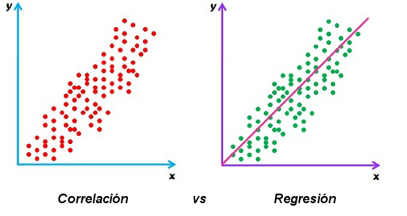
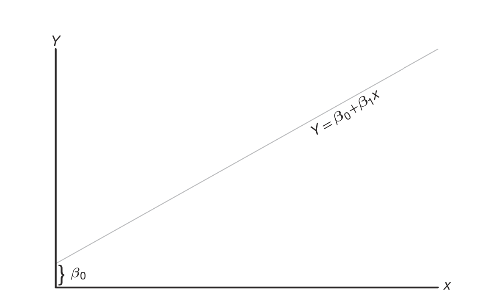
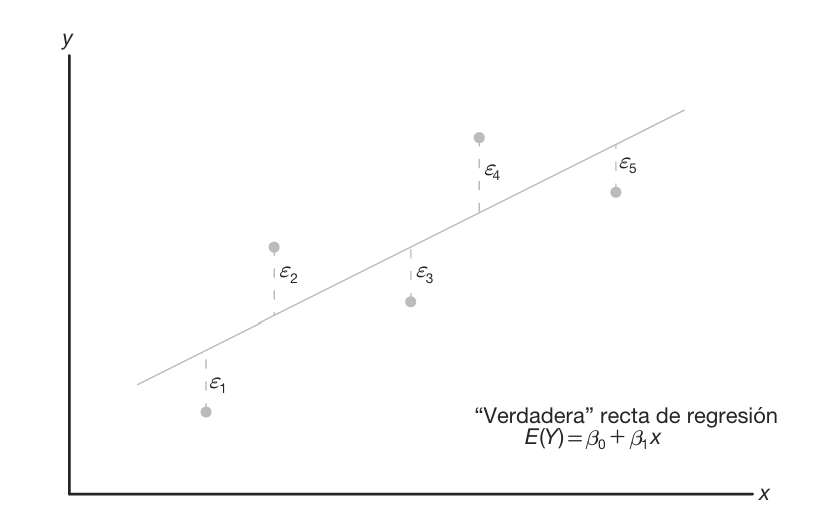

```{r setup, include=FALSE}
knitr::opts_chunk$set(echo = FALSE, warning = FALSE, message = FALSE)

library(ggplot2)
library(dplyr)
library(tidyr)
library(broom)
library(car)
library(MASS)
library(patchwork)

# Colores sugeridos de estilo institucional
verde_u <- "#0B6E4F"
verde_suave <- "#DCEFE8"
gris_claro <- "#F7F7F7"
```

```{css, echo=FALSE}
.remark-slide-content {
  font-size: 22px;
}

.title-slide {
  background-color: #0B6E4F;
  color: white;
}

h1, h2, h3 {
  color: #0B6E4F;
}

.remark-slide-content h1 {
  font-size: 36px;
  line-height: 1.2;
}

.remark-slide-content h2 {
  font-size: 30px;
  line-height: 1.2;
}

.caja {
  background-color: #DCEFE8;
  padding: 14px;
  border-left: 6px solid #0B6E4F;
  border-radius: 8px;
}

.small { font-size: 18px; }
.tiny { font-size: 15px; }
.center { text-align: center; }
.inverse {
  background-color: #163A2E;
  color: white;
}
```

# Indice de la clase

<div style="display:flex; gap:20px; flex-wrap:wrap; margin-top:40px;">

  <a href="#introduccion" style="padding:20px; background:#DCEFE8; border-radius:12px; text-decoration:none; color:#0B6E4F; font-weight:bold;">
    Introducción
  </a>

  <a href="#modelosreg" style="padding:20px; background:#DCEFE8; border-radius:12px; text-decoration:none; color:#0B6E4F; font-weight:bold;">
    Modelo lineal
  </a>

  <a href="#rls" style="padding:20px; background:#DCEFE8; border-radius:12px; text-decoration:none; color:#0B6E4F; font-weight:bold;">
    Regresión Simple
  </a>

  <a href="#residuos" style="padding:20px; background:#DCEFE8; border-radius:12px; text-decoration:none; color:#0B6E4F; font-weight:bold;">
    Residuos
  </a>

  <a href="#vif" style="padding:20px; background:#DCEFE8; border-radius:12px; text-decoration:none; color:#0B6E4F; font-weight:bold;">
    VIF
  </a>

  <a href="#aic" style="padding:20px; background:#DCEFE8; border-radius:12px; text-decoration:none; color:#0B6E4F; font-weight:bold;">
    AIC
  </a>

</div>

---

name: introduccion

<div style="position:absolute; top:30px; right:40px;">
  
</div>

# Propósito del módulo

<div style="display:flex; align-items:center; gap:40px;">

<div style="width:60%;">

Al finalizar esta unidad, el estudiante podrá:

<ul>
<li>Distinguir entre asociación y modelación.</li>
<br>
<li>Interpretar un modelo de regresión lineal múltiple.</li>
<br>
<li>Verificar sus supuestos básicos.</li>
<br>
<li>Analizar residuos y multicolinealidad.</li>
<br>
<li>Comparar modelos usando AIC.</li>
</ul>

</div>

<div style="width:40%; text-align:center;">


</div>

</div>

---

<div style="position:absolute; top:30px; right:40px;">
  
</div>

<br>

# ¿Por qué hablar de modelos lineales?

- En muchos problemas reales **no tenemos experimentos controlados**, sino datos observados.  

- Las variables suelen estar **relacionadas entre sí**, pero no siempre de forma evidente.  

- Queremos entender **cómo cambia una variable en función de otras**.  

- La regresión permite:
  - describir relaciones entre variables,
  - hacer predicciones,
  - apoyar la toma de decisiones.  

<div class="caja">
La regresión no necesariamente implica causalidad, sino que ayuda a identificar <strong>asociaciones</strong> entre variables.
</div>

---

# De la correlación a la regresión

<div style="position:absolute; top:30px; right:40px;">
  
</div>

<br>

<div style="display:flex; align-items:center; gap:40px;">

<div style="width:55%;">

<p><strong>Correlación</strong></p>

<ul>
<li>Mide intensidad y dirección de asociación lineal</li>
<li>No distingue variable respuesta y explicativas</li>
<li>No construye una ecuación predictiva</li>
</ul>

<br>

<p><strong>Regresión</strong></p>

<ul>
<li>Modela una variable respuesta</li>
<li>Cuantifica el efecto de varias explicativas</li>
<li>Permite explicar, predecir y evaluar incertidumbre</li>
</ul>

</div>

<div style="width:45%; text-align:center;">



</div>

</div>

<div style="margin-top:20px; font-size:18px; color:#2e7d32;">
<strong>Idea clave:</strong> La correlación describe relaciones, la regresión construye modelos.
</div>

---
name:modelosreg

<div style="position:absolute; top:30px; right:40px;">
  
</div>

# Modelo de regresión lineal

En la práctica, es común encontrar **conjuntos de variables que están relacionadas entre sí**.

<br>

**Ejemplos:**

<ul>
<li>El contenido de alquitrán depende de la temperatura en un proceso químico</li>
<li>El rendimiento de combustible depende de las características del motor</li>
<li>El precio de una casa depende de su tamaño y ubicación</li>
</ul>

<br>

Sin embargo, incluso con las mismas condiciones, los resultados pueden variar.

<br>

<div style="background:#DCEFE8; padding:15px; border-radius:10px;">

La regresión permite <strong>modelar estas relaciones</strong> y construir herramientas para explicar y predecir.

</div>

---

<div style="position:absolute; top:30px; right:40px;">
  
</div>

# Modelo de regresión lineal

<div style="display:flex; align-items:center; gap:40px;">

<div style="width:50%;">

La relación entre una variable respuesta \(Y\) y una variable explicativa \(X\) puede modelarse como:

<br><br>

<div style="font-size:24px;">
\( Y = \beta_0 + \beta_1 x \)
</div>

<ul>
<li>\(\beta_0\): intersección </li>
<li>\(\beta_1\): pendiente </li>
</ul>

Esta expresión representa una relación **ideal o promedio** entre las variables.

En la práctica, para un mismo valor de \(X\), los valores de \(Y\) pueden variar. Por ello, el modelo se extiende incorporando un término aleatorio.


</div>

<div style="width:50%; text-align:center;">



</div>

</div>

---

name: rls

<div style="position:absolute; top:30px; right:40px;">
  
</div>

# Modelo de regresión lineal simple

En regresión, la relación entre variables **no es exacta**, sino que incluye un componente de incertidumbre. Un modelo lineal simple se expresa como:

<div style="text-align:center; font-size:28px;">
\( Y = \beta_0 + \beta_1 x + \epsilon \)
</div>

**Interpretación de los componentes:**

<ul>
<li>\(Y\): variable respuesta</li>
<li>\(x\): variable explicativa</li>
<li>\(\beta_0\): intersección (valor esperado de \(Y\) cuando \(x = 0\))</li>
<li>\(\beta_1\): pendiente (cambio esperado en \(Y\) por unidad de \(x\))</li>
<li>\(\epsilon\): término aleatorio que recoge factores no observados o no medibles</li>
</ul>

El término $\epsilon$  refleja que, incluso para un mismo valor de \(x\), los valores de \(Y\) pueden variar.

<div style="background:#DCEFE8; padding:15px; border-radius:10px;">
<strong>Idea clave:</strong> El modelo lineal es una aproximación empírica que combina una relación sistemática y un componente aleatorio.
</div>

---

<div style="position:absolute; top:30px; right:40px;">
  
</div>

# Regresión lineal simple
## Componente aleatorio

<div style="display:flex; align-items:flex-start; gap:35px;">

<div style="width:55%;">

En el modelo de regresión lineal simple, la variable respuesta \(Y\) se considera <strong>aleatoria</strong>, mientras que la variable explicativa \(x\) se asume fija o medida con error despreciable.

El modelo puede escribirse como:

<div style="font-size:24px; text-align:center;">
\( Y = \beta_0 + \beta_1 x + \varepsilon \)
</div>

El término $\varepsilon$ representa el **error aleatorio** o la parte de la variabilidad de \(Y\) que no es explicada por \(x\).  
Este componente recoge factores no observados, no medidos o difíciles de controlar, y evita que el modelo sea una relación completamente determinística.

</div>

<div style="width:45%; text-align:center;">



<div style="font-size:16px; margin-top:8px; color:#555;">
Los datos observados se dispersan alrededor de la recta verdadera de regresión, y cada distancia vertical corresponde a un error aleatorio.
</div>

</div>

</div>
</div>

---

<div style="position:absolute; top:30px; right:40px;">
  
</div>

# Regresión lineal simple
## Componente aleatorio

Cuando se asume que $E(\varepsilon)=0$, se interpreta que, para cada valor de $x$, los valores de $Y$ tienden a distribuirse alrededor de una **recta verdadera de regresión**:

$$
E(Y)=\beta_0+\beta_1x
$$

<div style="display:flex; align-items:flex-start; gap:35px;">

<div style="width:55%;">

<p>
Si el modelo es adecuado, es razonable esperar errores positivos y negativos alrededor de esa recta.
Sin embargo, en la práctica los parámetros β₀ y β₁ son desconocidos y deben <strong>estimarse a partir de los datos</strong>.
</p>

<div style="background:#DCEFE8; padding:15px; border-radius:10px; margin-top:20px;">
En regresión lineal simple no observamos una relación exacta, sino una tendencia promedio alrededor de la cual los datos presentan variabilidad.
</div>

</div>

<div style="width:45%; text-align:center;">


<div style="font-size:16px; margin-top:8px; color:#555;">
Los datos observados se dispersan alrededor de la recta verdadera de regresión, y cada distancia vertical corresponde a un error aleatorio.
</div>

</div>

</div>


---

# Ejemplo contextual para ingeniería

Suponga que queremos explicar el **consumo energético** de una máquina a partir de:

- temperatura de operación,
- horas de uso,
- carga aplicada.

Modelo:

$$
\text{Consumo} = \beta_0 + \beta_1(\text{temperatura}) + \beta_2(\text{horas}) + \beta_3(\text{carga}) + \varepsilon
$$

Pregunta clave: ¿qué tanto aporta cada variable cuando las demás permanecen fijas?

---

# Regresión simple vs. múltiple

| Tipo | Ecuación | Uso |
|---|---|---|
| Simple | $Y=\beta_0+\beta_1X+\varepsilon$ | Una sola explicativa |
| Múltiple | $Y=\beta_0+\beta_1X_1+\cdots+\beta_pX_p+\varepsilon$ | Varias explicativas |

La regresión múltiple suele ser más realista en contextos aplicados, porque los fenómenos de ingeniería rara vez dependen de un solo factor.

---

# Especificación básica del modelo

Una buena especificación implica:

- definir claramente la variable respuesta,
- seleccionar explicativas relevantes según teoría o contexto,
- evitar incluir variables redundantes sin justificación,
- asegurar coherencia de unidades e interpretación.

::: {.caja}
Un modelo no empieza en el software: empieza con una pregunta bien formulada.
:::

---

# Estimación del modelo

Los coeficientes suelen estimarse por **mínimos cuadrados ordinarios (MCO)**.

Idea central:

- se eligen los valores de $\beta_0, \beta_1, \dots, \beta_p$
- que minimizan la suma de los residuos al cuadrado.

$$
\sum_{i=1}^{n}(y_i-\hat y_i)^2
$$

---

# ¿Qué es un residuo?

Para cada observación:

$$
e_i = y_i - \hat y_i
$$

- Si el residuo es pequeño, el modelo predice cerca del valor observado.
- Si el residuo es grande, el ajuste es peor para esa observación.

Los residuos serán la base para revisar si el modelo es razonable.

---

# Interpretación de coeficientes

Si obtenemos:

$$
\hat Y = 12 + 0.8X_1 - 1.5X_2 + 2.1X_3
$$

entonces:

- intercepto: 12,
- por cada unidad adicional en $X_1$, $Y$ aumenta en 0.8 en promedio,
- por cada unidad adicional en $X_2$, $Y$ disminuye en 1.5 en promedio,
- por cada unidad adicional en $X_3$, $Y$ aumenta en 2.1 en promedio,
- cada interpretación se hace **manteniendo constantes las demás variables**.

---

# Base de trabajo sugerida en R

Usaremos `mtcars` para introducir ideas.

- `mpg`: rendimiento de combustible,
- `wt`: peso,
- `hp`: caballos de fuerza,
- `disp`: desplazamiento.

Modelo ejemplo:

```{r}
modelo1 <- lm(mpg ~ wt + hp + disp, data = mtcars)
summary(modelo1)
```

---

# Lectura general del output

Elementos que los estudiantes deben identificar:

- coeficientes estimados,
- error estándar,
- estadístico t,
- valor p,
- error estándar residual,
- $R^2$ y $R^2$ ajustado,
- estadístico F global.

---

# Supuesto 1: linealidad

La relación entre la respuesta y cada explicativa debe ser aproximadamente lineal.

¿Cómo revisarlo?

- gráficos de dispersión,
- residuos vs. ajustados,
- conocimiento del fenómeno.

Señal de alerta:

- patrones curvos o sistemáticos en residuos.

---

# Supuesto 2: homocedasticidad

La variabilidad de los residuos debe ser aproximadamente constante.

Se viola cuando:

- la dispersión crece o decrece con los valores ajustados,
- aparece forma de abanico.

Consecuencia:

- los errores estándar pueden volverse poco confiables.

---

# Supuesto 3: normalidad residual

Los residuos no tienen que hacer normal a $Y$, sino que deben aproximarse a una distribución normal.

Esto es importante sobre todo para:

- intervalos de confianza,
- pruebas de hipótesis,
- inferencia en muestras pequeñas.

---

# Análisis de residuos

Revisaremos principalmente:

- residuos vs. ajustados,
- histograma de residuos,
- QQ-plot,
- residuos estandarizados,
- posibles puntos atípicos o influyentes.

---

# QQ-plot

El QQ-plot compara los cuantiles de los residuos con los cuantiles teóricos de una normal.

Interpretación:

- puntos cerca de la línea: normalidad razonable,
- desvíos fuertes en extremos: posibles colas pesadas u outliers,
- curvatura clara: posible no normalidad.

```{r}
qqnorm(resid(modelo1))
qqline(resid(modelo1), col = 2)
```

---

# Residuos vs. ajustados

```{r}
plot(modelo1, which = 1)
```

Qué mirar:

- nube aleatoria alrededor de cero,
- ausencia de curvaturas,
- dispersión aproximadamente constante.

---

# QQ-plot en R

```{r}
plot(modelo1, which = 2)
```

Pregunta orientadora para clase:

> ¿Los puntos siguen razonablemente la recta o hay evidencia clara de no normalidad?

---

# Multicolinealidad

Ocurre cuando dos o más explicativas están fuertemente relacionadas entre sí.

Problemas asociados:

- coeficientes inestables,
- errores estándar inflados,
- dificultad para interpretar efectos individuales.

---

# VIF: factor de inflación de la varianza

Una medida común es el **VIF**.

Interpretación usual:

- VIF = 1: sin colinealidad relevante,
- VIF entre 1 y 5: moderada,
- VIF mayor que 5 o 10: señal de alerta.

```{r}
car::vif(modelo1)
```

---

# Selección de modelos con AIC

El criterio AIC balancea:

- bondad de ajuste,
- complejidad del modelo.

Regla general:

- **menor AIC = mejor compromiso** entre ajuste y parsimonia.

No busca el modelo "más grande", sino uno razonable y eficiente.

---

# Comparación de modelos

```{r}
modelo2 <- lm(mpg ~ wt + hp, data = mtcars)
modelo3 <- lm(mpg ~ wt + hp + disp + qsec, data = mtcars)
AIC(modelo1, modelo2, modelo3)
```

Discusión:

- ¿agregar variables realmente mejora el modelo?
- ¿vale la pena la complejidad adicional?

---

# Selección paso a paso con AIC

```{r}
modelo_base <- lm(mpg ~ 1, data = mtcars)
modelo_full <- lm(mpg ~ wt + hp + disp + qsec + drat, data = mtcars)
stepAIC(modelo_full, direction = "both", trace = FALSE)
```

Aclaración:

- el método es útil como guía,
- pero nunca debe reemplazar el criterio sustantivo.

---

# Ejercicio 1

Con el modelo `mpg ~ wt + hp + disp`, responda:

1. ¿Cuál es la variable respuesta?
2. ¿Cuáles son las variables explicativas?
3. ¿Qué signo espera para el coeficiente de `wt` y por qué?
4. ¿Cómo se interpreta el coeficiente de `hp`?

---

# Respuesta ejercicio 1

1. La respuesta es `mpg`.
2. Las explicativas son `wt`, `hp` y `disp`.
3. Se espera signo negativo para `wt`, porque autos más pesados suelen tener menor rendimiento.
4. El coeficiente de `hp` representa el cambio promedio en `mpg` por una unidad adicional en potencia, manteniendo constantes `wt` y `disp`.

---

# Ejercicio 2

Observe el gráfico de residuos vs. ajustados.

Preguntas:

- ¿se aprecia curvatura?
- ¿la dispersión parece constante?
- ¿el supuesto de linealidad parece razonable?

---

# Respuesta ejercicio 2

Una respuesta esperada podría ser:

- si los puntos se dispersan sin patrón claro, la linealidad parece razonable,
- si aparece un abanico, puede haber heterocedasticidad,
- si hay una curva evidente, el modelo lineal puede ser insuficiente.

---

# Ejercicio 3

Se obtiene lo siguiente:

- `VIF(wt)=6.8`
- `VIF(hp)=2.4`
- `VIF(disp)=7.5`

Pregunta:

¿Qué variable(s) presentan mayor preocupación por multicolinealidad?

---

# Respuesta ejercicio 3

Las mayores señales de alerta están en `wt` y `disp`, porque sus VIF son relativamente altos.

Esto sugiere que parte de la información que aportan puede estar solapada.

---

# Ejercicio 4

Se comparan dos modelos:

- Modelo A: AIC = 185.2
- Modelo B: AIC = 179.6

Pregunta:

¿Cuál se preferiría según AIC y por qué?

---

# Respuesta ejercicio 4

Se preferiría el **Modelo B**, porque tiene menor AIC.

Eso indica mejor equilibrio entre ajuste y complejidad.

---

# Errores frecuentes al interpretar regresión

- creer que correlación implica causalidad,
- interpretar coeficientes sin mantener constantes las demás variables,
- ignorar supuestos del modelo,
- usar demasiadas variables sin justificación,
- decidir solo con p-valores.

---

# Cierre

Ideas clave:

- la regresión múltiple permite modelar una respuesta con varias explicativas,
- estimar no es suficiente: también hay que diagnosticar,
- residuos, QQ-plot, VIF y AIC son herramientas esenciales,
- un buen modelo combina ajuste, interpretación y sentido práctico.

---

# Próximo paso sugerido

En la siguiente versión podemos agregar:

- logo institucional,
- portada más visual,
- iconos y cajas de color,
- ejercicios con datos de ingeniería,
- gráficos más bonitos con `ggplot2`,
- preguntas tipo quiz con revelado progresivo.
